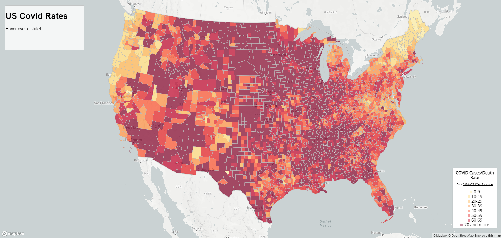

# Lab 3: Web Map Application

## Lab Introduction
Lab 3: Web Map Application for GEOG 458 explores building two thematic maps, one choropleth map showcasing the COVID-19 rates in map1.html and a proportional symbols map showcasing COVID-19 cases in map2.html. Here are the Github pages for [Map 1](https://abich1.github.io/covid-rates-and-cases/map1.html) and the one for [Map 2](https://abich1.github.io/covid-rates-and-cases/map2.html). 

# Screenshots
Below we can see screenshots of the created maps.

Here, we see a screenshot of Map 1 at the landing page or when not hovering over a county.

Here, we see a screenshot of Map 1 when hovering over King County, WA.

Here, we see a screenshot of Map 2 at the landing page or when a county is not clicked.

Here, we see a screenshot of Map 2 when King County, WA is clicked.

# Primary Functions

* Initialize the map
* Load the data and the layers
* Generate legend
* Interactivity when hovering/clicking to make county data appear

# Libraries

* Mapbox GL JS: renders interactive maps
* Google Fonts: imports Open Sans font

# Data Sources, Credits, and Acknowledgemts
The data for these maps come from different locations, with the COVID-19 case/death data from [The New York Times](https://github.com/nytimes/covid-19-data/blob/43d32dde2f87bd4dafbb7d23f5d9e878124018b8/live/us-counties.csv) and the case rates population data from the [2018 ACS 5 Year Estimates](https://data.census.gov/cedsci/table?g=0100000US.050000&d=ACS%205-Year%20Estimates%20Data%20Profiles&tid=ACSDP5Y2018.DP05&hidePreview=true).

These maps were created with of VS Code, Mapbox and the help of my TA Liz! Thank you to Liz for all your help!